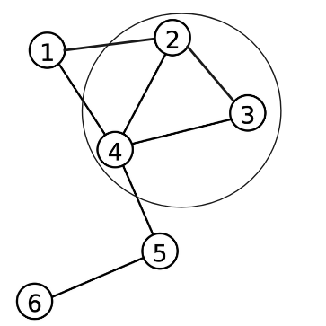

# Graph

**Description**: This notebook contains elaborate notes on Graph for Data structures and algorithms. 

>Note: This Python notebook utilizes xeus cling to enable C++ code execution within Jupyter Lab. Since this is an experimental feature, interpreter errors might occur. If you encounter any issues, try running the code again. Alternatively, you can fork the repository using the GitHub link below and execute it, or create a GitHub Codespace instance to run it in a separate sandbox environment.


Github link => [Graph](https://github.com/FreeRikato/DSA/tree/master/Problems/Graph)

Todos
- [x] Prerequisite Concepts for Graph => Basic Data Structures, Recursion Concepts
- [x] Graph Theory => Types of Grpah, Representation, Terminologies, Identification and Visualization
- [x] Graph Traversal => DFS, BFS, Intuition to code and Practice Sums
- [ ] Repository for the code => Intution to code, Practice Sums and Placement Preparation

## Prerequisite Concepts for Graph

### Basic Data structures
- Arrays and list: Representing graphs, especially when using adjacency lists
- Stacks and Queues:
    - BFS uses a queue (FIFO) for traversal
    - DFS uses a stack (LIFO) for traversal
    - Implemented using recursion or an explicit stack

### Recursion Concepts


=> Function calls itself + solve a smaller instance of the same problem + until it reaches a base case

=> Recursion is a very important concept, used in the harder DSA concepts like Trees, Graphs and Dynamic programming

[Visualizing Recursion tree with visualgo](https://visualgo.net/en/recursion)

- Base case
- Recursive case
- Call Stack

## Graph Theory

### Basics


- Vertices/Nodes (Entities -> Account) and Edges (Relationship between entities -> Connection between accounts)
- Vertices along with edges together, are called as graph
- The vertices that are joined by an edge are called 'adjacent'


#### Types of Graphs

 - Directed vs Undirected

 

- Weighted vs Unweighted


#### Graph Representation:

> 1. Adjacency matrix: A 2D array to represent edge connections i.e, If there are V vertices, take a matrix of VxV and store which vertices are adjacent to which vertices


>
> - If the graph is directed, the matrix would be asymmetrical
>
> - If the graph is weighted, store the weight in matrix instead of true/false
>


>
> Drawback: Takes O(V^2) memory even if number of edges is small
>
> For example,
>
>> * Number of Vertices = 10^5
>>
>> * Then, Number of Edges to be represented in matrix = 10^5 * 10^5 = 10^10
>

> 2. Adjacency list: An array of lists where each list represents a vertex and its adjacent vertices i.e, for each of the V vertices, keep a list of vertices which are adjacent to it


> Graphs, in which the number of edges aren't a lot compared to the number of vertices, are called "Sparse Graphs". Adjacency List representation is necessary when dealing with sparse graphs.


> - If the graph is weighted, store a pair of {vertex, weight} for all outgoing edges.
>
> Advantage: Takes only O(V+E) memory. (V lists and every edge adds 2 items to the lists in total)
>
> Note: The number of items in the adjacency list of a vertex is called the "degree" of that vertex

#### Understanding Graph to solve problems:
> Which of the metal nails will give you an electric shock upon touching?


> This introduces the concept of “Connectivity” in a graph.


#### Terminology related to Connectivity (or Reachability)

- `Path` : A sequence of *distinct* vertices such as A1 -> A2 -> A3 -> A4, such that there is an edge from A(x) to A(x+1)
- `Connectivity` : Vertex X is connected to Vertex Y if there is at least 1 path from X to Y
- `Connected Component` : A maximum group of vertices such that each of them is connected to one other


#### How to find a connected component?

1. Start from a vertex
2. All vertices adjacent to that vertex are in the same connected component
3. All of the vertices to those are in the same connected component and so on.


- There arises an issue where undirected graphs have vertices linked to each other

>- Ever been lost in a maze? Try marking some marks in the places you've already been,
>
>- so you don't get stuck in infinite loops.

#### Identifying a Graph Problem

A problem can be identified as a graph problem if it involves entities and relationships between them. Here are some common indicators:

1. **Paths and Connectivity**: If the problem involves finding paths, shortest paths, or connectivity between entities (e.g., cities, network nodes), it is likely a graph problem.
2. **Relationships**: When entities have relationships that can be represented as edges between nodes (e.g., social networks, road networks).
3. **Traversal**: If the problem requires visiting or traversing nodes in a specific manner (e.g., exploring all possible routes, searching for a specific node).
4. **Cycles and Components**: Problems involving detecting cycles, strongly connected components, or connected components.
5. **Optimization**: If the problem involves optimizing some criteria over a network of nodes and edges (e.g., minimum spanning tree, maximum flow).


### Graph Traversal


##### Cycles in a Graph and Tree

- A cycle is like a path that starts and ends at the same vertex
- For example, 2 -> 3 -> 4 -> 2
- A Connected graph without Cycles is called Tree. (A Disconnected Graph without cycles is called Forest.




#### DFS

[Visualize DFS with VisualGo](https://visualgo.net/en/dfsbfs)

We firstly go as deep as possible in a certain direction before going elsewhere


> Time Complexity: O(V + E), because every vertex is visited only once, and every edge is considered only twice, once from while visiting each of the end points of the edge

#### Build Intuition in DFS to code

1. DFS Graph Traversal
    - Problem: Given a graph, traverse all the nodes and print them.
    - Learning: Basic implementation of DFS, handling graph representations (adjacency list/matrix), and understanding the traversal order. 
2. Cycle Detection in Undirected Graph:
    - Problem: Determine if a given undirected graph contains a cycle.
    - Learning: Using DFS to backtrack and detect cycles by keeping track of visited nodes and their ancestors.
3. Connected Components:
    - Problem: Find all connected components in an undirected graph.
    - Learning: Applying DFS to explore and identify different connected components, marking nodes as visited in each component.
4. Topological Sorting:
    - Problem: Perform a topological sort on a directed acyclic graph (DAG).
    - Learning: Utilizing DFS to order nodes such that for every directed edge UV, vertex U comes before vertex V.
5. Pathfinding in a Maze:
    - Problem: Given a maze represented as a 2D grid, find a path from the start to the end.
    - Learning: Adapting DFS to navigate a 2D grid, marking paths, and backtracking when hitting dead ends.

##### DFS Graph Traversal


```c++
#include <iostream>
#include <vector>
#include <stack>
using namespace std;
```


```c++
// Function to perform DFS traversal
void DFS(int node, vector<vector<int>>& adjList, vector<bool>& visited) {
    stack<int> s;
    s.push(node);

    while (!s.empty()) {
        int current = s.top();
        s.pop();

        if (!visited[current]) {
            cout << current << " ";
            visited[current] = true;
        }

        for (int i = adjList[current].size() - 1; i >= 0; --i) {
            if (!visited[adjList[current][i]]) {
                s.push(adjList[current][i]);
            }
        }
    }
}
```


```c++
// Example graph represented as an adjacency list
vector<vector<int>> adjList = {
    {1, 2},       // Node 0 is connected to nodes 1 and 2
    {0, 3, 4},    // Node 1 is connected to nodes 0, 3, and 4
    {0, 4},       // Node 2 is connected to nodes 0 and 4
    {1, 4, 5},    // Node 3 is connected to nodes 1, 4, and 5
    {1, 2, 3, 5}, // Node 4 is connected to nodes 1, 2, 3, and 5
    {3, 4}        // Node 5 is connected to nodes 3 and 4
};

int n = adjList.size();
vector<bool> visited(n, false);

int start_node = 0;
// Start DFS from node 0
cout << "DFS Traversal starting from node " << start_node << " : ";
DFS(start_node, adjList, visited);
cout << endl;
```

    DFS Traversal starting from node 0 : 0 1 3 4 2 5 


##### Cycle Detection in Undirected Graph


```c++
#include <iostream>
#include <vector>
#include <list>

using namespace std;
```


```c++
bool DFS(int v, vector<bool>& visited, int parent, vector<list<int>>& adj) {
    visited[v] = true;

    for (int neighbor : adj[v]) {
        // If the neighbor is not visited, then recurse on it
        if (!visited[neighbor]) {
            if (DFS(neighbor, visited, v, adj))
                return true;
        }
        // If an adjacent vertex is visited and is not the parent of the current vertex,
        // then there is a cycle
        else if (neighbor != parent) {
            return true;
        }
    }
    return false;
}
```


```c++

bool isCycle(int V, vector<list<int>>& adj) {
    vector<bool> visited(V, false);

    // Call the recursive helper function to detect cycle in different DFS trees
    for (int u = 0; u < V; ++u) {
        if (!visited[u]) {
            if (DFS(u, visited, -1, adj))
                return true;
        }
    }
    return false;
}
```


```c++
int V = 5;  // Number of vertices
vector<list<int>> adj(V);

// Adding edges to the graph
adj[0].push_back(1);
adj[1].push_back(0);

adj[1].push_back(2);
adj[2].push_back(1);

adj[2].push_back(0);
adj[0].push_back(2);

adj[1].push_back(3);
adj[3].push_back(1);

adj[3].push_back(4);
adj[4].push_back(3);

if (isCycle(V, adj))
    cout << "Graph contains cycle" << endl;
else
    cout << "Graph doesn't contain cycle" << endl;
```

    Graph contains cycle


##### Connected Components


```c++
#include <vector>
#include <iostream>
using namespace std;

const int N = 10000;
vector<int> adj_list[N];
bool visited[N];
```


```c++
void dfs(int curr) {
    visited[curr] = true;
    for (int next : adj_list[curr]) {
        if (
            visited[next]) continue;
        dfs(next);
    }
}
```


```c++
int n = 8, m = 5;

adj_list[1].push_back(2);
adj_list[2].push_back(1);

adj_list[2].push_back(3);
adj_list[3].push_back(2);

adj_list[2].push_back(4);
adj_list[4].push_back(2);

adj_list[3].push_back(5);
adj_list[5].push_back(3);

adj_list[6].push_back(7);
adj_list[7].push_back(6);
int ans = 0;

// Perform DFS for each component
for (int i = 1; i <= n; i++) {
    if (!visited[i]) {
        dfs(i);
        ans++;
    }
}

cout << "Number of Connected Components: " << ans << '\n';
```

    Number of Connected Components: 3


##### Topological Sorting


```c++
#include <iostream>
#include <vector>
#include <stack>
using namespace std;
```


```c++
void topologicalSortUtil(int v, vector<bool>& visited, stack<int>& Stack, vector<vector<int>>& adj) {
    visited[v] = true;

    for (int i = 0; i < adj[v].size(); ++i) {
        if (!visited[adj[v][i]]) {
            topologicalSortUtil(adj[v][i], visited, Stack, adj);
        }
    }

    Stack.push(v);
}

```


```c++
void topologicalSort(int V, vector<vector<int>>& adj) {
    stack<int> Stack;
    vector<bool> visited(V, false);

    for (int i = 0; i < V; i++) {
        if (!visited[i]) {
            topologicalSortUtil(i, visited, Stack, adj);
        }
    }

    while (!Stack.empty()) {
        cout << Stack.top() << " ";
        Stack.pop();
    }
    cout << endl;
}
```


```c++
int V = 6;
vector<vector<int>> adj(V);

adj[5].push_back(2);
adj[5].push_back(0);
adj[4].push_back(0);
adj[4].push_back(1);
adj[2].push_back(3);
adj[3].push_back(1);

cout << "Topological Sort of the given graph is: \n";
topologicalSort(V, adj);
```

    Topological Sort of the given graph is: 
    5 4 2 3 1 0 


##### Pathfinding in a Maze


```c++
#include <iostream>
#include <vector>

using namespace std;

// Directions arrays for moving in 4 possible directions (up, down, left, right)
int dirX[] = {-1, 1, 0, 0};
int dirY[] = {0, 0, -1, 1};
```


```c++
// Function to check if the current cell is valid
bool isValid(int x, int y, vector<vector<int>> &maze, vector<vector<bool>> &visited) {
    int rows = maze.size();
    int cols = maze[0].size();
    return (x >= 0 && y >= 0 && x < rows && y < cols && maze[x][y] == 1 && !visited[x][y]);
}
```


```c++
// DFS function to find a path in the maze
bool dfs(vector<vector<int>> &maze, vector<vector<bool>> &visited, int x, int y, vector<pair<int, int>> &path) {
    // If the destination is reached
    if (x == maze.size() - 1 && y == maze[0].size() - 1) {
        path.push_back({x, y});
        return true;
    }

    // Mark the current cell as visited
    visited[x][y] = true;
    path.push_back({x, y});

    // Explore the four possible directions
    for (int i = 0; i < 4; ++i) {
        int newX = x + dirX[i];
        int newY = y + dirY[i];
        if (isValid(newX, newY, maze, visited) && dfs(maze, visited, newX, newY, path)) {
            return true;
        }
    }

    // Backtrack if no path is found
    path.pop_back();
    return false;
}

```


```c++
// Example input: 1 is path, 0 is wall
vector<vector<int>> maze = {
    {1, 0, 0, 0},
    {1, 1, 0, 1},
    {0, 1, 0, 0},
    {1, 1, 1, 1}
};

int rows = maze.size();
int cols = maze[0].size();

vector<vector<bool>> visited(rows, vector<bool>(cols, false));
vector<pair<int, int>> path;

if (dfs(maze, visited, 0, 0, path)) {
    cout << "Path found:\n";
    for (auto cell : path) {
        cout << "(" << cell.first << ", " << cell.second << ") ";
    }
    cout << endl;
} else {
    cout << "No path found.\n";
}
```

    Path found:
    (0, 0) (1, 0) (1, 1) (2, 1) (3, 1) (3, 2) (3, 3) 


#### DFS Practice Sums
1. [Connected Components in a Graph](https://www.hackerearth.com/problem/algorithm/connected-components-in-a-graph/)
2. [Counting Rooms](https://cses.fi/problemset/task/1192)
3. [Labyrinth](https://cses.fi/problemset/task/1193)
4. [Round Trip](https://cses.fi/problemset/task/1669)

Note: Grid/Maze is also a graph, Every square in the grid is a vertex and implicitly there are upto 4 edges -> L, R, U & D


When working with grids, you do not need to keep an adjacency list, you can find all 4 adjacent vertices easily:

For (x, y) the adjacent vertices are:

`int dx[4] = {1, 0, -1, 0};`

`int dy[4] = {0, 1, 0, -1};`

- (x, y + 1)
- (x + 1, y)
- (x - 1, y)
- (x, y - 1)

#### BFS

How Would you tackle the below problem?
=> Find Minimum number of roads to get from house to school


The above can be termed as "Shortest Path Problem". And since we care only about the number of roads and not the length of the roads, we consider the unweighted graph

The general idea to solve this problem is pretty intuitive:
- Start with source index, the "distance" for that is 0
- All vertices adjacent to source have distance 1
- All unvisited vertices which are adjacent to atleast one of vertices with distance 1 have distance 2
- All unvisited vertices which are adjacent to atleast one of vertices with distance x have distance (x+1)
- Keep repeating previous step until the destination is found

But how can we implement this as a computer program?
Ans: QUEUE


> => We are using a queue because of the FIFO principle. The vertex which is seen first is nearer to the source, so it is best if it is popped first, this guarantees that no vertex with a higher distance from the source is popped before a vertex with a lower distance
>
> => Time Complexity: O(V+E), the reasoning is similar to DFS, a vertex is visited only once and an edge is considered only twice at most.

#### Build Intuition in BFS to code
1. BFS Graph Traversal
    - Problem: Given a graph, traverse all the nodes and print them in BFS order.
    - Learning: Basic implementation of BFS, handling graph representations (adjacency list/matrix), and understanding the traversal order.
2. Shortest Path in an Unweighted Graph
    - Problem: Given an unweighted graph, find the shortest path from a source node to a target node.
    - Learning: Using BFS to find the shortest path in an unweighted graph since BFS naturally explores nodes layer by layer, ensuring the shortest path is found first.
3. Cycle Detection in an Undirected Graph
    - Problem: Determine if a given undirected graph contains a cycle.
    - Learning: Using BFS to detect cycles by keeping track of visited nodes and their parents. If a node is visited again and it’s not the parent, a cycle exists.
4. Level Order Traversal in a Binary Tree
    - Problem: Given a binary tree, perform a level order traversal and print nodes at each level.
    - Learning: Implementing BFS in a tree structure, using a queue to traverse nodes level by level, which is essential for understanding how BFS handles hierarchical data.

##### BFS Graph Traversal


```c++
#include <iostream>
#include <vector>
#include <queue>
#include <list>

using namespace std;
```


```c++
// Function to perform BFS traversal
void BFS(int startNode, const vector<list<int>>& adjList, vector<bool>& visited) {
    queue<int> q;  // Create a queue for BFS
    visited[startNode] = true;  // Mark the start node as visited
    q.push(startNode);  // Enqueue the start node

    while (!q.empty()) {
        int node = q.front();  // Get the front node from the queue
        cout << node << " ";  // Print the node
        q.pop();  // Dequeue the node

        // Get all adjacent vertices of the dequeued node
        for (auto it = adjList[node].begin(); it != adjList[node].end(); ++it) {
            if (!visited[*it]) {  // If the adjacent node is not visited
                visited[*it] = true;  // Mark it as visited
                q.push(*it);  // Enqueue the adjacent node
            }
        }
    }
}
```


```c++
// Function to add an edge to the graph
void addEdge(vector<list<int>>& adjList, int u, int v) {
    adjList[u].push_back(v);  // Add v to u’s list
    adjList[v].push_back(u);  // Since the graph is undirected, add u to v's list
}
```


```c++
int V = 5;  // Number of vertices in the graph
vector<list<int>> adjList(V);  // Adjacency list representation of the graph

// Adding edges to the graph
addEdge(adjList, 0, 1);
addEdge(adjList, 0, 2);
addEdge(adjList, 1, 2);
addEdge(adjList, 1, 3);
addEdge(adjList, 2, 3);
addEdge(adjList, 3, 4);

vector<bool> visited(V, false);  // Vector to keep track of visited nodes

int start_node = 1;
cout << "BFS Traversal starting from node : " << start_node << endl;
BFS(start_node, adjList, visited);  // Perform BFS traversal from node 0
```

    BFS Traversal starting from node : 1
    1 0 2 3 4 

##### Shortest Path in an Unweighted Graph


```c++
#include <iostream>
#include <vector>
#include <queue>
#include <unordered_map>
#include <list>
#include <stack>
```


```c++
// Function to add an edge to the graph
void addEdge(std::unordered_map<int, std::list<int>>& graph, int u, int v) {
    graph[u].push_back(v);
    graph[v].push_back(u);  // For undirected graph
}
```


```c++


// Function to find the shortest path using BFS
std::vector<int> shortestPathBFS(std::unordered_map<int, std::list<int>>& graph, int src, int dest) {
    std::unordered_map<int, bool> visited;
    std::unordered_map<int, int> parent;
    std::queue<int> q;

    q.push(src);
    visited[src] = true;
    parent[src] = -1;

    while (!q.empty()) {
        int node = q.front();
        q.pop();

        // If destination node is found
        if (node == dest) {
            break;
        }

        for (int neighbor : graph[node]) {
            if (!visited[neighbor]) {
                q.push(neighbor);
                visited[neighbor] = true;
                parent[neighbor] = node;
            }
        }
    }

    // Reconstructing the path
    std::vector<int> path;
    for (int at = dest; at != -1; at = parent[at]) {
        path.push_back(at);
    }
    std::reverse(path.begin(), path.end());

    // If the source node is not the start of the path, then there is no path
    if (path[0] != src) {
        path.clear();
    }

    return path;
}
```


```c++
std::unordered_map<int, std::list<int>> graph;

// Adding edges to the graph
addEdge(graph, 0, 1);
addEdge(graph, 0, 2);
addEdge(graph, 1, 2);
addEdge(graph, 1, 3);
addEdge(graph, 2, 3);
addEdge(graph, 3, 4);
addEdge(graph, 4, 5);

int src = 0;
int dest = 5;

std::vector<int> path = shortestPathBFS(graph, src, dest);

if (path.empty()) {
    std::cout << "No path found from " << src << " to " << dest << std::endl;
} else {
    std::cout << "Shortest path from " << src << " to " << dest << ": ";
    for (int node : path) {
        std::cout << node << " ";
    }
    std::cout << std::endl;
}
```

    Shortest path from 0 to 5: 0 1 3 4 5 


##### Cycle Detection in an Undirected Graph


```c++
#include <iostream>
#include <vector>
#include <queue>
#include <list>

using namespace std;
```


```c++
class Graph {
    int V; // Number of vertices
    list<int> *adj; // Adjacency list

public:
    Graph(int V);
    void addEdge(int v, int w);
    bool isCyclic();
};
```


```c++
// Constructor
Graph::Graph(int V) {
    this->V = V;
    adj = new list<int>[V];
}
```


```c++
// Function to add an edge to the graph
void Graph::addEdge(int v, int w) {
    adj[v].push_back(w);
    adj[w].push_back(v);
}
```


```c++
// Function to check if the graph contains a cycle
bool Graph::isCyclic() {
    vector<bool> visited(V, false); // Mark all vertices as not visited

    for (int i = 0; i < V; i++) {
        if (!visited[i]) { // Don't revisit already checked components
            // BFS using queue
            queue<pair<int, int>> q; // Pair of (current node, parent node)
            visited[i] = true;
            q.push({i, -1}); // Start from vertex i with no parent

            while (!q.empty()) {
                int node = q.front().first;
                int parent = q.front().second;
                q.pop();

                for (auto adjacent : adj[node]) {
                    if (!visited[adjacent]) {
                        visited[adjacent] = true;
                        q.push({adjacent, node});
                    } else if (adjacent != parent) {
                        // If an adjacent node is visited and not parent, cycle exists
                        return true;
                    }
                }
            }
        }
    }
    return false;
}
```


```c++
Graph g(5); // Create a graph with 5 vertices
g.addEdge(0, 1);
g.addEdge(1, 2);
g.addEdge(2, 0);
g.addEdge(1, 3);
g.addEdge(3, 4);

if (g.isCyclic()) {
    cout << "Graph contains cycle" << endl;
} else {
    cout << "Graph doesn't contain cycle" << endl;
}
```

    Graph contains cycle


##### Level Order Traversal in a Binary Tree


```c++
#include <iostream>
#include <queue>

// Define the structure of a tree node
struct TreeNode {
    int val;
    TreeNode* left;
    TreeNode* right;
    TreeNode(int x) : val(x), left(nullptr), right(nullptr) {}
};
```


```c++
// Function to perform level order traversal
void levelOrderTraversal(TreeNode* root) {
    if (root == nullptr) {
        return;
    }

    std::queue<TreeNode*> q;
    q.push(root);

    while (!q.empty()) {
        int levelSize = q.size();  // Number of nodes at the current level

        for (int i = 0; i < levelSize; ++i) {
            TreeNode* currentNode = q.front();
            q.pop();
            std::cout << currentNode->val << " ";

            if (currentNode->left != nullptr) {
                q.push(currentNode->left);
            }
            if (currentNode->right != nullptr) {
                q.push(currentNode->right);
            }
        }
        std::cout << std::endl;  // Print a new line after each level
    }
}
```


```c++
// Helper function to insert nodes in the binary tree for demonstration
TreeNode* insertLevelOrder(int arr[], TreeNode* root, int i, int n) {
    if (i < n) {
        TreeNode* temp = new TreeNode(arr[i]);
        root = temp;

        root->left = insertLevelOrder(arr, root->left, 2 * i + 1, n);
        root->right = insertLevelOrder(arr, root->right, 2 * i + 2, n);
    }
    return root;
}
```


```c++
// Create a binary tree using an array representation
int arr[] = {1, 2, 3, 4, 5, 6, 7};
int n = sizeof(arr) / sizeof(arr[0]);
TreeNode* root = insertLevelOrder(arr, root, 0, n);

std::cout << "Level Order Traversal of the binary tree is:" << std::endl;
levelOrderTraversal(root);
```

    Level Order Traversal of the binary tree is:
    1 
    2 3 
    4 5 6 7 


#### BFS Practice Sums

1. [Message Route](https://cses.fi/problemset/task/1667)
2. [NAKANJ - Minimum Knight moves !!!](https://www.spoj.com/problems/NAKANJ/)
3. [Monsters](https://cses.fi/problemset/task/1194)
4. [Snake and Ladder Problem](https://www.geeksforgeeks.org/problems/snake-and-ladder-problem4816/1)


```c++

```
